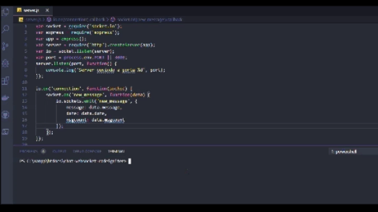

Consiste em um chat em tempo real usando websocket a partir do plugin socket.io e usando o framework codeigniter que é desenvolvido em php juntamente com nodejs. 
No gif abaixo(apesar da qualidade de ruim de imagem), eu primeiramente rodo na raiz do projeto o arquivo server.js com o comando: 
$ node server.js

após isto o websocket ja está ativo e funcional... 

Fonte do estudo: https://techalltype.com/
